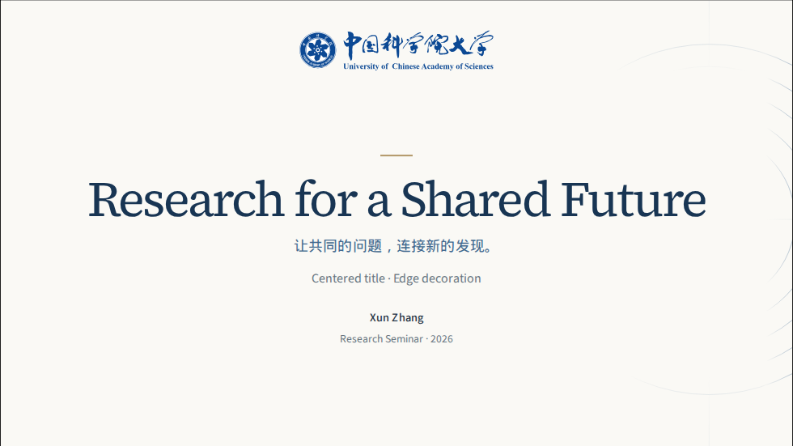
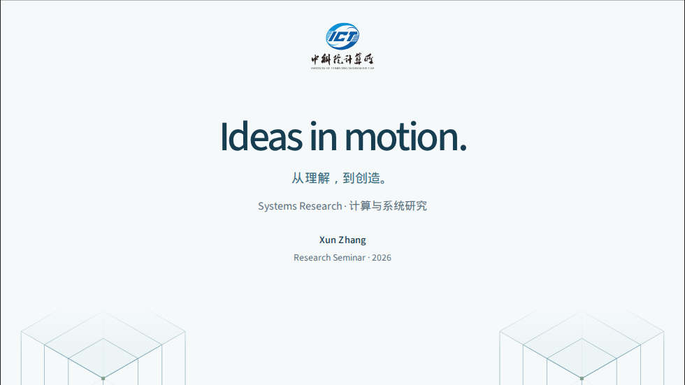
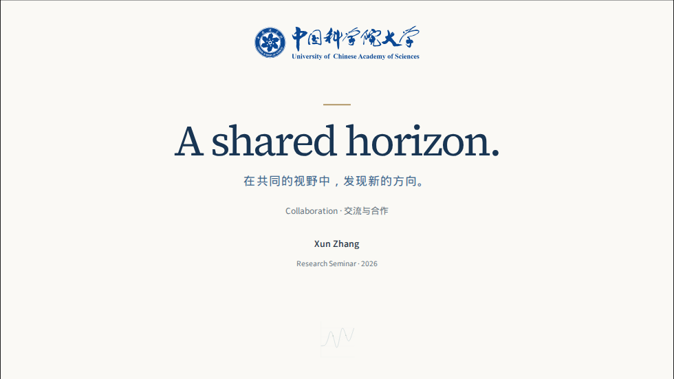
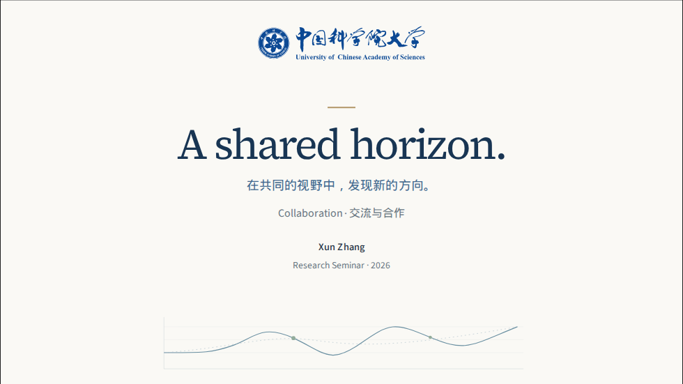
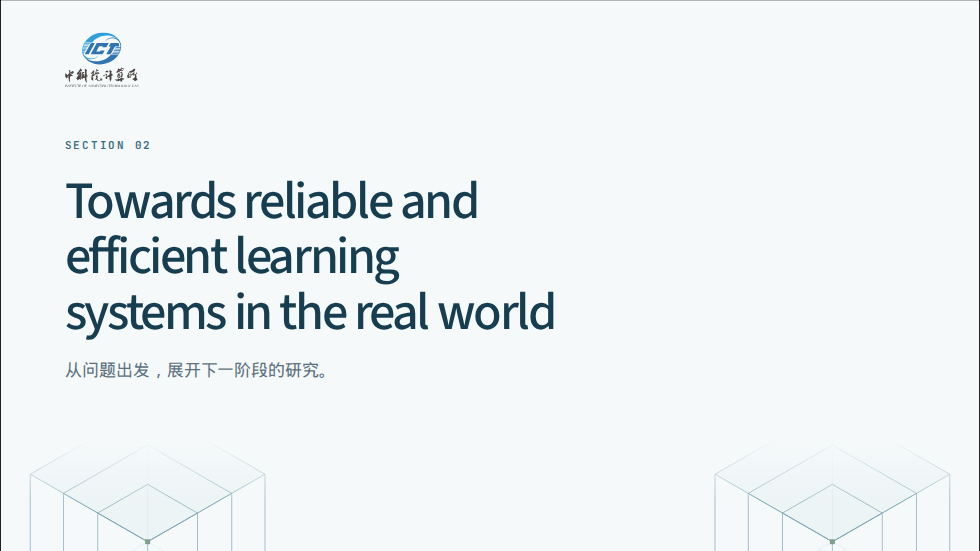
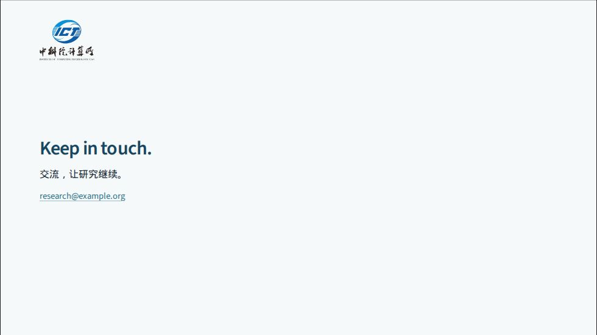

# 封面设计与 artwork 搭配审查

2026-09-12。使用本次重新构建、截取的三个 preset 画面进行修改前后比较。结论：保留各套字体、配色和机构标识，将封面的文字尺度、装饰位置和内容留白统一到共用规则。

1. **封面排版与机构标识：已统一。** 标题、副标题、说明和署名采用共同的字号层级与间距；保留长标题、带页眉封面的紧凑规则。右侧内置图案以渐隐边缘融入页面，UCAS 次级校徽减轻视觉权重。居中封面显式选择 `right` 时，图案收在边缘并省略次级校徽，标题保留中央阅读区。

   

2. **artwork 构图与素材比例：已优化。** ICT 底部原有五个重复立方体像一排围栏，改为两侧嵌套结构，延续右侧图案的空间关系。背景模式提高边缘可见度，中央继续淡出。自定义底部示例从竖幅缩略图改为横幅信号图，保留 `contain` 和作者指定的透明度。完整结果图仍应使用 `image` / `imageAlt`。

   | 修改前 | 修改后 |
   | --- | --- |
   |  |  |
   |  |  |

   `center + right` 的定位是边缘点缀；需要完整展示居中图案时，采用 `auto` / `bottom`。`field` 继续作为低强调的装饰色场，不承载需要辨读的信息。

3. **章节与结束页：已修复避让。** 底部装饰原先只在封面预留空间，长章节标题可能延伸到图案区域。现在章节、简洁结束页也预留底部空间并调整标题尺度。包含联系方式、作者或自定义 logo 的结束页关闭 artwork，恢复完整的内容区域。

   

   

验证结果：26 页 × 980/720 两种宽度 × 明暗模式，共 **104 个案例通过**；原 artwork 回归保留 **48 张截图**，图片回退、主题切换和动画／减少动态效果／打印检查通过。配置检查 28 项、资源检查 2 项及 CSS 架构检查通过。新增断言检查实际标题文字范围、文字与品牌的重叠、章节／结束页的底部避让和联系方式页的可用高度。

无障碍检查覆盖代表性封面；未进行真实投影环境或屏幕阅读器人工评估。完整截图及几何报告保存在 `.artifacts/design-review-20260912/before/` 与 `after/`。用 [26 页示例](../fixtures/cover-alignment.md) 检查自己的标题与图片组合；搭配建议见 [README](../README.md#match-the-motif-to-the-content)。
