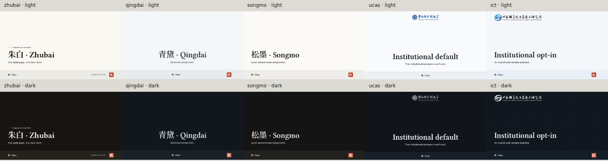

# 知白五预设的视觉身份

五套预设共享布局与语义 token，分别决定字体角色、阅读密度、图表、引用和签名。这些属于默认设计，不增加作者开关；标准 `fonts` 配置可以替换各角色的实际字族。

| 预设 | 展示／内容标题 | 阅读与内容处理 | 签名 |
| --- | --- | --- | --- |
| 朱白 | 衬线展示／无衬线内容 | 1.6 行高、书写式引文、朱色列表标点 | 细朱线，可选印章 |
| 青黛 | 衬线展示与内容 | 1.65 行高、中轴横线、居中引文、细线表格 | 页书式横线，不加朱色标题规则 |
| 松墨 | 无衬线展示与内容 | 1.5 行高、黑白图表与提示、无阴影图像 | 单线页底与等宽章节编号；无装饰朱点 |
| UCAS | 衬线展示／无衬线内容 | 1.55 行高、机构蓝表格规则、紧凑图注 | 官方校标、内容页脚细线 |
| ICT | 无衬线展示与内容 | 1.5 行高、等宽标签、技术网格与轻度交替表格 | 官方所标、技术章节编号 |

| 预设 | 亮色纸面 | 结构色 | 封面与章节 |
| --- | --- | --- | --- |
| `zhubai` | 宣纸 `#faf8f3` | 墨与朱色标点 | 中轴衬线封面，底部轻色信息带；章节保留编号轴 |
| `qingdai` | 月白 `#f4f6f7` | 黛蓝 | 中轴衬线标题，细线夹题 |
| `songmo` | 素白 `#fbfaf7` | 纯墨 | 中轴无衬线封面，垂直居中的主张，透明落款区 |
| `ucas` | 冷白 `#f9fafc` | 学术蓝 | 中轴学术封面，原始中英文机构签名 |
| `ict` | 蓝灰白 `#f7f9fb` | 信号蓝 | 中轴技术封面，等宽章节索引与网格 |

五种预设的封面默认水平居中，可用 `coverAlign: left` 设置左对齐。朱白、青黛、松墨没有机构 logo，无图封面共用同一套垂直居中与上下内距规则，将标题、副标题和正文作为一组放在署名区上方。长标题和多人署名使用共享的紧凑间距；UCAS、ICT 为机构 logo 保留自己的顶部空间。

每套预设都有显式暗色纸面与提亮结构色。机构标识使用原始资产，配色是主题的设计决定，不代表整套机构品牌规范。资产来源见 [主题边界](./theme-boundary.md#institutional-sources)。

中文引文在朱白、青黛与 UCAS 中优先使用本地楷体，松墨与 ICT 使用无衬线。代码、页码与技术索引使用标准 `fonts.mono`。原生布局使用同一预设解析路径；`none` 不注入主题。强调色、页脚和字体的覆盖规则见 [配置文档](./configuration.md)。

[暗色对照](./assets/zhubai/preset-contact-sheet-dark.png)

验收入口是 [同内容对照](../examples/preset-gallery.md)，覆盖五预设 × 封面／章节／正文／图表／引用／数字，另有 [技术分享](../examples/technical-talk.md)、[研究报告](../examples/research-report.md)、[课程讲义](../examples/course.md) 三份完整模板。使用 [交互预览](./authoring.md#交互预览与逐页源码) 比较页面，并复制对应的 Markdown。
