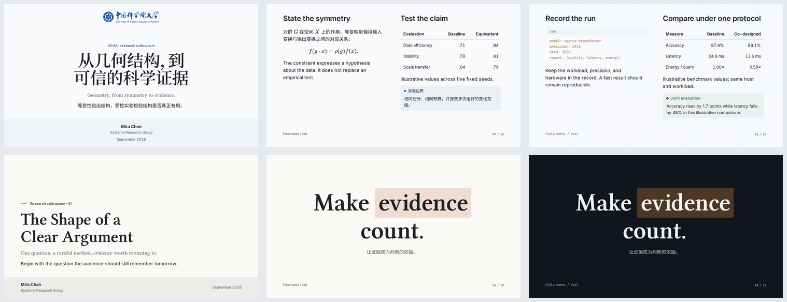

# Veil 0.4 视觉评审

> 评审日期：2026-09-29。评审对象：按 `veil-design-proposal.md` 实施的 0.4 重设计。
> 证据：`docs/assets/veil/light.png`、`dark.png`、`preview.png`（2026-09-29 11:30 重拍）；`pnpm run quality:design` 37/37 通过。

## 总体判断：通过

0.4 忠实执行了设计提案，"GPT 感"基本消除。serif display + 有温度的纸面 + 色面组件让主题第一次有了明确的观点；三个 preset 从"换 logo"升级为"三种构图语言"。

## 验收清单逐条核对

| # | 一眼测试 | 结果 |
| --- | --- | --- |
| 1 | 遮住 logo，3 秒区分三个 preset | 封面/章节 ✅；**UCAS 与 ICT 的内容页仍偏弱 ⚠️** |
| 2 | 找不到一条纯装饰性 hairline | ✅（页眉/页脚/分栏竖线均删除；表格只剩 header rule，`styles/base.css:207`） |
| 3 | 每页只有一个高饱和焦点 | ✅（statement 的 highlight mark、克制的 accent） |
| 4 | 不再被认成"AI 生成" | ✅（serif 大字 + 纸白 + meta 色带，杂志感取代了模板感） |
| 5 | 投影距离可读、serif 只在展示位 | ✅（正文 Inter 18px；serif 仅用于 ≥36px 的封面/章节/statement/引文） |

## 实现核实（抽查）

- 三色板完全按提案落地：default `#faf9f6/#2f3b46/#c2572e`，ucas `#f9fafc/#1d4e8e/#b3352c`，ict `#f7f9fb/#0b6bcb/#d9730d`；chart 色序经 `--veil-chart-*` 暴露。
- 章节序号按提案成为构图元素：accent 9% 淡色大号 folio 压于标题层之下（`shared.css:462`），UCAS 居中、ICT 为 mono `SEC.03`，三者构图语言不同。
- statement 96px（`tokens.css:102`，`--presentation-size-96`），highlight mark 落词准确。
- eyebrow 全部 `text-transform: none`，句格式小字，default 保留 24px 细线，ICT 蓝杠已删除。
- 深色为中性墨 `#101214`，UCAS/ICT 混入 4% accent 色相；深色 mark（highlight 24% over ink ≈ `#402d27` 底 + 浅字）对比度约 10:1，达标。
- ICT 蓝图网格仅出现于封面/章节页（`ict.css:140` 的 `::before`），内容页保持干净。
- 组件色面化到位：callout 无边框圆角色面 + 形状 marker；代码块无边框 + 语言标签条；表格仅 header 一线。

## 遗留打磨项（原始评审，现已处理）

1. **UCAS 与 ICT 内容页区分度（唯一实质项）**：浅色纸 `#f9fafc` 与 `#f7f9fb` 仅差 2 个 RGB 单位，两个蓝 accent 在页码、表头线等小面积上仍接近。建议二选一：ICT 内容页保留 1.2–1.5% 透明度的网格；或 ICT 内容页 h1 增加 mono kicker/编号前缀。封面与章节页已足够区分，此问题仅影响内容页连排对比。
2. **default 封面 meta 带偏淡**：accent 4% over paper 几乎与纸面融为一体，"一块被设计过的颜色"还不够成立，建议提到 6–7%。
3. **statement 中文副标题的亲和性**：14px 灰字与 96px 标题距离过远，建议 16–18px 并收一点间距。
4. **UCAS 封面中文标题断行**："从几何结构，到 / 可信的科学证据"的逗号后空隙偏大，检查 CJK 断行与 `text-wrap: balance` 的交互。
5. **（可选）深色 mark 提亮**：highlight 24% 可提到 28%，让 statement 关键词在深色下更跳。

## 结论

0.4 可以定稿。上述 5 项均为打磨而非方向问题；建议先处理第 1 项（内容页区分度），其余随 0.4.x 迭代。

## 打磨落实记录（2026-09-29）

以上保留原始评审意见。五项均已处理，本节与重新生成的截图代表当前实现。

| 项目 | 落实结果 |
| --- | --- |
| ICT 内容页辨识度 | 内容布局增加 8px、1.5% 蓝图网格；封面/章节维持 2.5%。UCAS、default、statement 与 closing 不新增纹理。网格继续使用固定 preset 色，不随作者局部 accent 改变。 |
| default 封面信息带 | 浅色 accent 混合比例由 4% 提至 7%，深色信息带保持原有配方。 |
| statement 副标题 | 实际原字号为 21px；视觉疏离主要来自两段 margin 叠加到约 46px。现设为 18px，标题下方只保留 16px 间距，中文行高为 1.6。 |
| UCAS 中文标点 | 对比 `balance`、`pretty`、普通换行后保留 `balance`，因为后两者会把示例中的“可信”拆开。通过标题字体的 `halt` 特性压缩全角标点占位，保留原文和原生 Markdown H1；详见[字体说明](./veil-typography.md#post-review-spacing-refinement)。 |
| 深色 mark | 三套 preset 的 highlight 混合比例统一从 24% 提至 28%。 |

验证：画廊 37/37、封面对齐 109/109 通过；8 个受影响页面 × 明暗两种模式的 axe 抽查无违规，实测 statement 为 18px / 16px 间距、ICT 内容网格 alpha 为 0.015。CSS 架构检查与 `git diff --check` 通过。本次为局部打磨，未重跑此前完整 685 项检查。

证据：`.artifacts/quality/veil-polish-review.json`、`logs/veil-polish-*.log`，以及重新生成的[浅色联系图](./assets/veil/light.png)、[深色联系图](./assets/veil/dark.png)。

