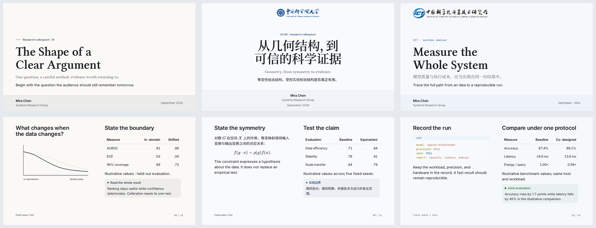

# Veil 0.4 implementation review

The user-selected [design proposal](./veil-design-proposal.md) is the visual target. The previous 0.3 results are historical and do not validate this revision. The 0.4 implementation has passed the complete quality run and the final visual review.

## Implementation

Paper, Folio and Blueprint now have warm/cool paper canvases, separate accent/highlight colors, neutral ink-dark surfaces and chart color tokens. Serif display headings pair with sans reading text and explicit Chinese partners. Covers have a full-width tonal information band; sections use large pale folios; statements support 96px emphasis and adapt for longer content.

Header/footer rules and the column divider are removed. Footers default to deck label and page, retaining explicit author opt-in. Components use tonal callouts, a table header separator, native code-language labels, pill tags, hanging quotations, filled sequence nodes and raised figures. Media treatments remain additive to existing variants and accessible fallbacks. The removed artwork engine stays removed; ICT's CSS grid uses 2.5% on covers/sections and, after the follow-up polish, 1.5% on content layouts.

## Review iterations

- Reviewed three cover and one content prototypes before component execution.
- Fixed the cover information band being clipped by the scroll container, preserving real author/affiliation/date rows across the canvas.
- Separated large chapter folios from headline text; marked the pale ornamental numerals as decorative while retaining an accessible section label.
- Corrected preset selector overrides for 13px eyebrows and chart colors that must follow custom accents in dark mode.
- Verified actual loaded Latin/CJK faces through Chromium; its face names include Libertinus SemiBold and Noto variable-font base names.
- Preserved native authored headings, named slots and the UCAS emblem's internal cutouts in dark mode.
- Kept 28px quotations in dense columns while tightening their indent/leading; gave headers a practical vertical budget. Fixed the two-column prop default so the 4rem token actually controls the gutter.
- Detached ICT's grid color from deck-local accents to preserve institutional signature pixels.
- Restored compact editorial caption stacking and centered UCAS closings, keeping existing media/layout contracts.
- Corrected H2/H3/H4 to 28/21/18px and preserved existing author-owned figure numbers rather than prefixing them twice.
- Restored 4rem horizontal insets on optional cover chrome.
- Final media screenshots exposed a cover selector overriding bleed image fit. Fixed the rendered image fit, preserved explicit `contain`, and added a mode-aware translucent reading zone above arbitrary image colors. This supplements the proposal’s edge gradient; a 20% dark gradient alone did not keep light images readable in dark mode.

## Verification

On 2026-09-29, `node scripts/run-quality-gates.mjs` passed all 21 phases in 550.389 seconds (exit 0): 13 maintained fixture builds and 685 reported Node test cases, with no failures or skipped cases. This includes 392 accessibility/interaction/layout cases, 53 cover composition cases, 109 cover alignment cases, native Slidev layouts, actual Latin/CJK font loading, motion, preset isolation and the 36 light/dark gallery slides.

After that complete run, the final screenshot review led to the narrowly scoped bleed-fit/reading-veil correction above. `node --test tests/quality/veil-surfaces.spec.mjs` was rebuilt and passed again for all five slides in both modes, including new rendered-fit and overlay assertions. `node scripts/check-presentation-css.mjs` and `git diff --check` also passed. The complete suite was not repeated after this isolated correction; it does not affect slides without bleed media.

The 18-page light and dark contact sheets and the six-page preview have been regenerated and visually reviewed. Optional cover chrome, custom caption numbering, native code labels, framed images and both full-bleed modes received additional screenshot review. The busy alignment image in the media fixture is intentionally diagnostic, not a recommended presentation background.

`npm pack --dry-run --json` verifies `slidev-theme-veil@0.4.0` with 55 packaged entries. No package was published.

Results are retained in `.artifacts/quality/summary.json`, phase logs, accessibility reports and screenshots; `.artifacts/quality/veil-0.4-post-review.json` records the targeted final verification. The main font configuration uses network-loaded fonts; offline authors should install or self-host the documented families.

Current specifications are [the design contract](./veil-redesign.md), [typography](./veil-typography.md), [the comparison deck](../fixtures/preset-design.md) and [the media/code fixture](../fixtures/veil-surfaces.md).

[Light contact sheet](./assets/veil/light.png) · [Dark contact sheet](./assets/veil/dark.png)

## Follow-up polish

The five items in the [archived visual review](./veil-0.4-review.md#打磨落实记录2026-09-29) are resolved: ICT content grid at 1.5%, default light cover band at 7%, statement subtitles at 18px with a 16px gap, compact UCAS cover punctuation with balanced wrapping, and dark marks at 28%. The gallery (37 cases), cover alignment (109 cases), 16 targeted axe page/mode audits and CSS architecture passed on this revision. The earlier full-suite result remains historical; this small follow-up used targeted verification. Current screenshots have been regenerated.
