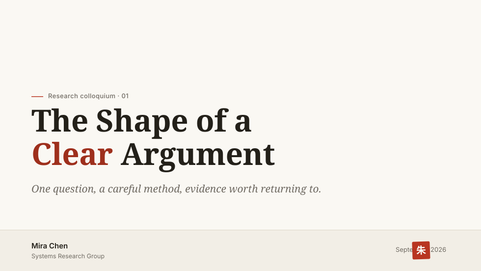

# 朱白 (zhubai) 设计文档

> 状态：已实施并通过质量验收（见 [实施记录](./zhubai-implementation.md)） · 面向版本：0.5.0 · 前任主题：slidev-theme-veil 0.4.0
> 吸收：[样式优化审计](./veil-style-optimization.md)（问题诊断仍然有效） · 取代：[0.4 设计契约](./veil-redesign.md) 中与本方案冲突的部分



## 0. 摘要

**朱白**是一次更名，也是一次设计立场的确立：安静的白色纸面，克制的墨色文字，以及每页至多一点的朱砂红。名字取自印章的两面——**朱文**（红字白底，亮色模式）与**白文**（白字红底，暗色模式与印章本身）。

Veil 0.4 的审计结论是：工程扎实，但视觉趋同、色彩系统缺位、暗色发灰。朱白不改这套工程骨架，而是给它一个真正的灵魂：

- **一个色相**：全主题唯一的彩色是朱。结构色（纸、墨、黛）随预设变化，**朱色不变**——它是贯穿所有预设的签名。
- **一条纪律**："一页一朱"。红色有预算，焦点由作者内容决定，主题只提供机制。
- **一个信物**：印章（seal）。每个预设、每种模式下都盖着同一枚朱印。

三个美学预设：**朱白**（signature，宣纸白 + 朱砂）、**青黛**（月白 + 黛蓝，清冷书卷）、**松墨**（纯墨单色，唯一无结构色相的预设）。机构预设 UCAS / ICT 保留并迁入新架构。

## 1. 概念：朱白的四个出处

| 出处 | 含义 | 在主题中的对应 |
| --- | --- | --- |
| **朱文 / 白文** | 印章的阳文与阴文 | 亮色模式 = 朱文（朱落白纸）；暗色模式 = 白文（纸白文字落于墨夜，朱印不变） |
| **朱批** | 传统批注：红笔只写最要紧的话 | `==标记==` 与焦点词渲染为朱，每页一处 |
| **留白** | 白不是空，是材料 | 封面与章节页的大面积空白是构图主体，不填装饰 |
| **墨分五色** | 浓、重、淡、清 | 文字与边界的灰阶层级全部由墨色稀释派生，不引入第二个彩色 |

这套概念不是包装，是约束：它直接回答了 Veil 时代"accent 该用在哪""暗色怎么不发灰""预设怎么区分"三个问题。

## 2. 设计原则

1. **一页一朱。** 朱色分两种用法：**结构性朱**（细线、列表朱点，小而重复，低存在）与**焦点朱**（印章、朱批、焦点词，一页至多一处）。除此之外无彩色。
2. **结构随预设，朱色不变。** 预设之间换纸、换墨、换构图；印章与朱批的朱在所有预设、所有模式下是同一个色料 token。
3. **白是材料。** 任何装饰必须让位于留白；拿不准就删掉。
4. **暗色是白文，不是反色。** 暗色独立设计：墨夜为底、纸白为字、朱印依旧。不允许用公式把亮色 accent 直接洗白。
5. **中文是一等公民。** 宋体（明朝体）承载 display，楷体承载引文；所有字排决策双语验收。
6. **API 冻结。** 布局、组件 props、frontmatter 语义不变；新增能力（seal、kicker 等）全部可选。

## 3. 色彩系统

### 3.1 色料（pigments）

原始色料使用 `--zhubai-*` 命名，语义层仍消费 `--presentation-*`（见 §9 迁移）。

| 色料 | Token | 亮色值 | 暗色值 | 说明 |
| --- | --- | --- | --- | --- |
| 朱砂 | `--zhubai-zhu` | `#b83521` | `#d9644c` | 印章、朱线、朱点（图形级，亮底对比度 5.5:1） |
| 朱砂·沉 | `--zhubai-zhu-deep` | `#9e2f1c` | `#e0785f` | 焦点词、朱批文字（文字级，亮底 6.9:1，暗底 5.1:1） |
| 宣纸 | `--zhubai-paper` | `#faf8f3` | — | 朱白预设 canvas |
| 墨 | `--zhubai-ink` | `#232019` | `#efe9df` | 浓墨为字（15.3:1） |
| 夜墨 | `--zhubai-night` | — | `#171511` | 暗色 canvas，微暖 |
| 月白 | `--zhubai-moon` | `#f4f6f7` | — | 青黛预设 canvas |
| 黛 | `--zhubai-dai` | `#2f4257` | `#8aa5c4` | 青黛结构色（9.5:1 / 7.1:1） |
| 松烟 | `--zhubai-mo` | `#1c1b19` | `#e8e6e1` | 松墨预设唯一的"色" |

以上对比度均经 WCAG 公式核算，≥ AA（4.5:1）。

### 3.2 墨的灰阶（墨分五色）

文字与边界不从 accent 派生，全部从墨色稀释：

| 角色 | 派生 | 用途 |
| --- | --- | --- |
| 浓墨 | `--zhubai-ink` 100% | 正文、标题 |
| 重墨 | ink 68% | 副题、caption、chrome |
| 淡墨 | ink 45%（新增 `--presentation-text-faint`） | 页脚、folio 数字之外的第三级 |
| 清墨 | ink 10% / 22% | border / border-strong |

### 3.3 角色与预算

| 角色 | Token | 谁在用 | 预算 |
| --- | --- | --- | --- |
| 结构色 | `--presentation-accent` | eyebrow、链接、编号、当前态 | 不限（低饱和场景） |
| 焦点朱 | `--presentation-focus`（默认 `var(--zhubai-zhu-deep)`） | `==朱批==`、`.presentation-focus`、焦点词 | **每页 ≤ 1 处** |
| 图形朱 | `--zhubai-zhu` | 印章、标题朱线、列表朱点 | 结构性，小面积 |

图表色板：`--zhubai-chart-1` 结构色、`-2` 朱、`-3/-4` 墨的 56%/30%、`-5/-6` 结构色的 55%/30% 明度变体（扩到 6 色，回应审计中"色板太弱"）。

### 3.4 暗色 = 白文模式

- 暗色 canvas 用 `--zhubai-night`（微暖墨黑），不是亮色的简单反相。
- 朱在暗色**提亮不提灰**：`#d9644c` / `#e0785f`，保持色相——这是与 Veil 暗色（accent 洗成灰蓝）最直观的区别。
- 印章在暗色下保持不变：朱底白字。墨夜上的一点朱，是整个暗色模式的视觉锚。
- 三个预设的暗色底分别带 6–8% 自身色相（松墨为 0%，纯中性）。

## 4. 预设家族

### 4.1 `zhubai` 朱白（默认，signature）

宣纸白 + 浓墨 + 朱砂。编辑式构图：

- 封面：默认中轴，eyebrow 带 24px 短朱线，serif 700 标题；无图时标题组在署名区上方垂直居中，底部 meta 带使用浅色面与顶部发丝线。
- 内容页：H1 下方一条 2.5rem × 1.5px 朱线——朱白预设的签名节奏；列表一级 marker 为 0.32rem 朱色菱形。
- 正文行高 1.6，衬线用于展示标题，无衬线用于内容层级；表格保留纸面。
- 章节页：淡墨 144px folio 数字（透明度从 9% 提到 16%）+ 右下一枚小朱印对位，构成"大而淡"与"小而浓"的张力。

### 4.2 `qingdai` 青黛（新增）

月白 + 黛蓝 + 朱印。清冷的学院气质，适合文献综述、理论报告：

- 内容页标题**居中**，上下各一条 1px 黛色细线（双线夹题，章回体书口的处理）——全家族唯一居中标题的内容页。
- 内容标题使用衬线，正文行高 1.65；引用沿中轴排版，表格使用细线。
- 章节页居中，folio 数字用 oldstyle 衬线。
- 封面默认居中构图，无图时标题组在署名区上方垂直居中，meta 带上下各一条发丝线。
- 朱印与朱批仍为朱色——"万黛丛中一点朱"。

### 4.3 `songmo` 松墨（新增）

纯白 + 纯墨，**全预设零结构色相**：链接、eyebrow、编号全部是墨。唯一的彩色是印章与朱批的朱。

- 最极端的"安静"：页面是纯黑白排版，朱印成为唯一的、也因此最强的签名。
- 链接用下划线 + 墨色区分（无彩色依赖，天然满足色彩无障碍）。
- 展示标题与引用使用无衬线；正文行高 1.5，图表与提示使用黑白层级，图像无阴影。
- 无图封面使用与朱白、青黛相同的垂直居中与上下内距规则，底部信息区透明；章节使用等宽编号，移除装饰朱点。
- 适合哲学、文学、以及"不想让观众分心"的场合。

### 4.4 机构预设（ucas / ict）

保留，迁入新 token 架构（§9）：

- 结构色维持机构蓝（`#1d4e8e` / `#0b6bcb`），签名资产不动。
- 暗色 accent 改为按预设定义的提亮值（修复 Veil 的洗灰缺陷）：ucas `#7aa5e0`、ict `#5aa3e8`。
- 印章默认**关闭**（机构有自己的签章），可显式开启；朱批焦点色沿用各预设现有 highlight（ucas 的 `#b3352c` 恰好也是朱系）。
- ICT 网格从 8px 密格改为 24px 主格 + 8px 细分，透明度 3%/5%（暗色 6%）——现在的 1.5% 密格等于没有。
- UCAS 正文行高 1.55，表格使用固定机构蓝细线，内容页脚保留细线；ICT 展示与引用使用无衬线，正文行高 1.5，表头和图注使用等宽标签。

### 4.5 家族一览

| 预设 | 纸 | 结构色 | 构图签名 | 朱 |
| --- | --- | --- | --- | --- |
| `zhubai` | 宣纸 `#faf8f3` | 墨 | 左轴 + 标题朱线 + 菱形朱点 | 印 + 批 |
| `qingdai` | 月白 `#f4f6f7` | 黛 `#2f4257` | 居中双线夹题 | 印 + 批 |
| `songmo` | 素白 `#fbfaf7` | 无（纯墨） | 纯黑白排版 | 印 + 批（唯一彩色） |
| `ucas` | 冷白 `#f9fafc` | 学术蓝 | 居中礼仪封面 + 校名签名 | 批（印默认关） |
| `ict` | 蓝灰白 `#f7f9fb` | 信号蓝 | mono 标签 + 疏主格图纸 | 批（印默认关） |

验收使用 [同内容对照](../examples/preset-gallery.md)，同时检查五预设的封面、章节、正文、图表、引用与数字页；当前默认设计见 [预设身份](./preset-identities.md)。

## 5. 签名元素

### 5.1 印章（seal）

朱白最重要的新组件——每一场演讲的落款。

```md
themeConfig:
  presentation:
    seal: "陈"          # 1–4 字，deck 级
---
layout: cover
seal: "米拉"            # 可选，单页覆盖
```

- 渲染：36px 方章，朱底（`--zhubai-zhu`）白文（纸白字符），Libertinus Serif / Noto Serif SC 700（西文 / 中文），圆角 2.5px，整体旋转 -2°——像手盖的，不像贴的。
- 位置：封面 meta 带右端（日期之后）；closing 布局落款处；章节页可选。
- 缺省：未配置 `seal` 则不渲染，不留占位。
- 机构预设默认关闭。
- 可访问性：印章为装饰性署名，`role="img"` + `aria-label="Seal: 陈"`；不承载唯一信息。

### 5.2 朱批（mark / focus）

`==文字==` 的新处理，取代 Veil 的矩形色块补丁：

- 正文内：文字保持墨色，淡朱底（`color-mix(zhu 10%, transparent)`，2px 圆角）+ 1.5px 朱色下划（45% 透明）——像红笔在字下划了一道。
- display 场景（statement / 封面标题内）：焦点词纯 `zhu-deep` 文字色，无底无框——96px 上的色块是补丁，96px 上的朱字是批注。

### 5.3 朱线与朱点

- **朱线**：朱白预设内容页 H1 下 2.5rem × 1.5px；封面 eyebrow 前 24px × 1.5px。全页细线中唯一的彩色线。
- **朱点**：一级列表 marker 为 0.32rem 菱形（45° 旋转方），朱 80%；二级为空心墨菱形。有序列表编号保持墨色 tabular。

### 5.4 章节页

- folio 大数字：144px，透明度 9% → 16%（暗色同步），松墨预设用 12% 纯墨。
- 朱白 / 松墨：数字右下对位一枚 24px 小朱印（seal 启用时）或 8px 朱点（未启用时）。
- ICT：`SEC.` 前缀 + 描边数字（`-webkit-text-stroke: 1px`，accent 30%，transparent fill）。

### 5.5 封面构图

修正 Veil 封面"重心塌陷"：

- 标题块 padding-block 上限 `clamp(2.25rem, 5vh, 3.5rem)` → `clamp(3rem, 8vh, 5rem)`，留白从"空"变成"托"。
- meta 带：背景 accent 4% → 6%，顶部 1px 发丝线，内部三栏（作者 | 日期 | 印章）。
- 构图变体：左轴（zhubai/ict）、居中（qingdai/ucas）、`::visual::` 与 `background` 行为不变。

## 6. 字体排印

| 角色 | Latin | 中文 | 规格 |
| --- | --- | --- | --- |
| 封面 / 章节 / Statement | `fonts.serif`；松墨与 ICT 用 `fonts.sans` | 对应标准字族，display 700 | 64 / 48 / ≤96px |
| 内容页 H1 | `fonts.sans`；青黛用 `fonts.serif` | 对应标准字族 | **40px**（two-cols 30px），字距 -0.02em |
| 引文 | 标准衬线；松墨与 ICT 用无衬线 | 朱白、青黛与 UCAS 优先本地楷体；松墨与 ICT 用无衬线 | 28px；引用层级由预设决定 |
| 正文 | `fonts.sans` | 对应标准字族 | 18px；预设行高 1.5–1.65，显式 CJK 1.6 |
| 标签 / 页码 / 编号 | 标准 sans / mono，ICT 标签用 mono | 同左 | 12–16px |

默认字族为 Inter、Libertinus Serif、JetBrains Mono、Noto Sans SC 与 Noto Serif SC。加载统一由 Slidev 决定，支持 `fonts.local` 与 `provider: none`；主题不注入远程字体 CSS。其余 CJK hanging-punctuation、`halt`、text-autospace 沿用排印契约。详见 [字体配置](./configuration.md#标准字体与离线演示)。

## 7. 布局与组件处理

**内容页页首三段式**：可选 frontmatter `kicker`（内容页，此前仅章节页有）→ kicker（13px label）+ H1（40px）+ 预设签名线（朱线 / 双线 / 无）。

**Statement**：支持焦点词——`==词==` 渲染为朱色文字；副标题与标题间距 16→20px。

**Quote**：按预设选择衬线、楷体或无衬线（§6）；引用来源前可选小朱点。

**Callout**：保留 borderless tonal 面，左侧加 2px family 色条（现行 family 色只在 0.48rem marker 上，3 米外不可辨）；marker 形状系统保留。

**表格**：可选 `.presentation-table--booktabs` 三线表（顶 1.5px / 表头下 1px / 底 1.5px，无纵线）；默认表头、细线与交替行由预设决定，独立于可选强调色。

**TOC**：条目编号用朱色 serif oldstyle（朱白）/ 黛色（青黛）/ 墨色（松墨）——目录是朱色被允许"重复出现"的少数场景（结构性朱）。

**Figure / Steps / Badge / Tag / Kbd**：保留组件接口；普通图像的圆角与阴影由预设决定，`framed` 继续提供更强的展示层级。

**原生布局与配置**：`fact / full / two-cols-header / image / iframe` 继承同一预设解析，`none` 留给作者；双栏支持 `columnRatio`。公开使用 `showFooter`，与文字内容 `footer` 区分；单页 `presentation` 与全局使用相同字段，`accent: auto` 恢复当前预设结构色。完整规则见 [配置文档](./configuration.md)。

## 8. 动效与阴影

全部参数 token 化（替代现行硬编码）：

```css
--presentation-motion-duration: 520ms;
--presentation-motion-easing: cubic-bezier(0.22, 1, 0.36, 1);
--presentation-motion-stagger: 40ms;
--presentation-motion-rise: 16px;
--presentation-shadow-1: 0 1px 2px rgb(35 32 25 / 4%), 0 8px 24px rgb(35 32 25 / 6%);
--presentation-shadow-2: 0 2px 6px rgb(35 32 25 / 6%), 0 16px 40px rgb(35 32 25 / 10%);
```

- **盖章**：封面印章入场——`scale 1.4 → 1` + 淡入，260ms，末端轻微过冲（cubic-bezier(0.34, 1.56, 0.64, 1)），在文字入场（stagger 160ms）之后落下。全主题最有性格的一帧。
- 封面 visual 入场加 `scale 0.985 → 1`。
- `prefers-reduced-motion` 与打印全部静态，现行行为不变。

## 9. 重命名与迁移

### 9.1 更名范围

| 项 | 从 | 到 |
| --- | --- | --- |
| npm 包 | `slidev-theme-veil` | `slidev-theme-zhubai`（0.5.0 起） |
| 主题引用 | `theme: slidev-theme-veil` | `theme: slidev-theme-zhubai` |
| 默认预设 id | `default` | `zhubai`（`default` 作为别名保留一个次版本，控制台提示迁移） |
| 色料 token | `--veil-*` | `--zhubai-*` |
| 语义 token | `--presentation-*` | **不变** |
| class / data 属性 | `.slide-*`、`data-presentation-preset` | **不变** |
| 图表 token | `--veil-chart-*` | `--zhubai-chart-*`（旧名 alias 一个次版本） |
| 文件 | `styles/presets/default.css` | `styles/presets/zhubai.css`（+ 新增 `qingdai.css`、`songmo.css`） |
| 文档 | `docs/veil-*.md` | 新文档以 `zhubai-*.md` 命名；历史 veil 文档保留存档 |
| 仓库名 | `slidev-theme-4obsidian` | 建议同步改为 `slidev-theme-zhubai` |

### 9.2 token 架构（与更名同做）

1. 提取 `styles/presets/base.css`：三个现行 preset 文件约 90% 重复的 token 块只留一份；各预设只写 delta（纸、墨、结构色、字体角色、签名特征）。预设文件从约 230 行降到 60–80 行。
2. 命名契约（写入 `docs/zhubai-tokens.md`）：
   - `--zhubai-*`：色料与品牌资产（zhu、ink、paper、dai、chart、grid）——预设层定义；
   - `--presentation-*`：语义角色（bg、text、border、字体角色、尺寸、动效、阴影）——从色料派生，布局/组件只消费这一层。
3. 层级约定：尺寸/字体角色在 `.slidev-layout, .slide-frame`；颜色在预设作用域；frame 级只放真正 per-frame 的值。

## 10. 实施路线

| 阶段 | 内容 | 产出 |
| --- | --- | --- |
| **P0 地基** | token 架构整理 + 更名脚手架（包名、文件、alias、文档骨架） | `quality` 全绿，行为零变化 |
| **P1 朱白** | zhubai 预设落地：色料、白文暗色、朱线朱点、朱批、封面 meta 三栏 | 默认预设焕然；暗色不再发灰 |
| **P2 印章** | seal 组件（配置、渲染、a11y）+ 盖章动效 + 章节页对位 | 签名元素就位 |
| **P3 家族** | qingdai + songmo 两个新预设；ucas/ict 迁入新架构并修暗色 | 五预设联系表两两可辨 |
| **P4 精修** | 楷体引文、CJK 700、内容页 kicker、booktabs、动效 token 化 | 全部质量门更新完毕，发 0.5.0 |

每阶段独立可发布；P1+P2 即可构成 0.5.0 的最小叙事（"更名 + 朱白 + 印章"）。

## 11. 验证

沿用 `pnpm run quality`，需要新增/更新的契约：

- **新增** `zhubai-design.spec.mjs`：朱色 token 值、朱线/朱点存在性、暗色朱色不提灰（计算样式断言色相）、白文模式背景值；
- **新增** seal 用例：渲染几何、aria-label、缺省不渲染、机构预设默认关闭、reduced-motion 下无盖章动画；
- 更新 `typography.spec.mjs`（H1 40px、CJK display 700、楷体栈）、`accessibility.spec.mjs`（朱/黛亮暗对比度用例，数值见 §3.1）、`preset-isolation.spec.mjs`（五预设）；
- 截图：`screenshot:{zhubai,qingdai,songmo,ucas,ict}` × 亮/暗联系表，按 §4.5 目检；
- 行为探针：暗色下朱色 computed style 的色相角在 0–20° 区间（防回归洗灰）。

## 12. 兼容性承诺

- 布局、组件 props、frontmatter 字段语义不变；`seal`、`kicker`（内容页）、`.presentation-table--booktabs` 均为可选新增；
- `--presentation-*` 语义 token 名称保留；`--veil-*` → `--zhubai-*` 提供别名过渡一个次版本；
- 预设 id `default` 别名保留一个次版本；
- 机构签名资产与位置不动；artwork 引擎不恢复；
- Slidev ≥ 52.15.2、Node ≥ 20.19 要求不变。
